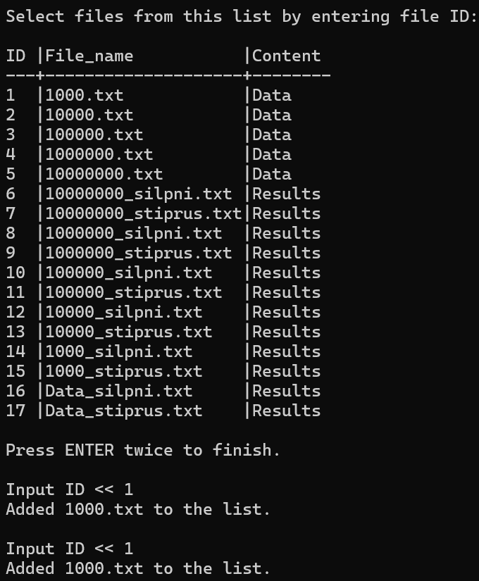
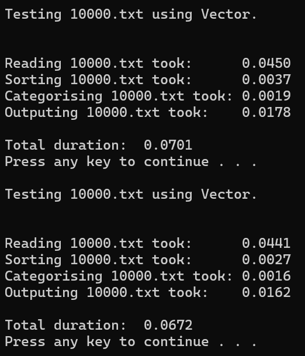
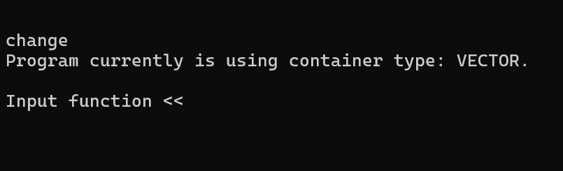
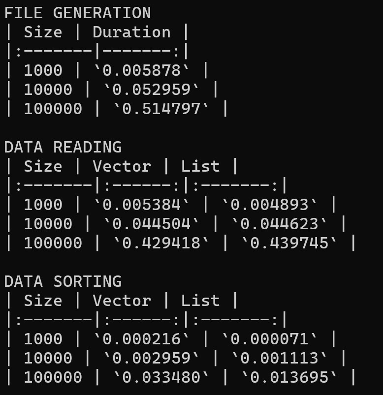

# Students

## Table of Contents
- [Description](#description)
- [Data Structure](#data-structure)
- [Usage](#usage)
- [Efficiency](#efficiency)
- [System](#system-specifications)

## Description
The **Students** application is designed to help working with students data. Mainly for writing and reading 
data and quickly finding final results of student. Also, it is equiped with functions for programs speed measurements. 

## Data Structures
### Structure: `Stud`
- **string** `vardas`:      Student's first name.
- **string** `pavarde`:     Student's last name.
- **vector<int\>** `nd`:    Vector to store homework results.
- **int** `egz`:            Exam result.
- **double** `final_vid`:   Result using average value of homeworks.
- **double** `final_med`:   Result using median value of homeworks.
- **category** `cat`:       Categories: Under if result < 5 and Over if result >= 5.

### Structure: `Test_data`
- **map\<string, Record>** `vec_test`:  Map for storing testing results with specific file (**string** is filename) using vector.
- **map\<string, Record>** `list_test`: Map for storing testing results with specific file (**string** is filename) using list.
- **map\<string, double>** `fg_durations`: Map for storing file generation durations, where **string** is file name and **double** is duration.
`Test_data` stores all testing results during single work session with the program.

### Structure: `Record`
- **double** `input`:   Total duration of input.
- **double** `sorting`: Total duration of sorting.
- **double** `categorising`: Total duration of categorising.
- **double** `output`: Total duration of outputing to files.
- **double** `total`: Total duration of all tests.
- **int** `count`:  Number of tests for this record.

## Usage
To use the application, run the program and follow the prompts to input one of the listed commands
 (**Test**, **Create**, **Open**, **Show**, **Check**, **End**, **Info**, **Change**, **Results**).

## System Specifications

### 1. Processor (CPU)
- **Model:** Intel(R) Core(TM) i3-1005G1
- **Frequency:** 1.20 GHz (base)
- **Number of Cores:** 2
- **Number of Threads:** 4
- **Cache:** 4 MB

### 2. Memory (RAM)
- **Capacity:** 20.0 GB
- **Type:** DDR4

### 3. Hard Drive (SSD)
- **Type:** SSD (Solid State Drive)
- **Capacity:** 224GB
- **Read Speed:** Up to 520 MB/s
- **Write Speed:** Up to 450 MB/s

## Efficiency

### Sorting Function
For sorting **std::sort** was used with comparator function for sorting by diffrent keys.
The asymptotic speed of **std::sort** is `O(n log n)` where `n` is number of students in a vector.
Comparator function in some cases campares two strings which involves cheking each cahracter in a string. 
Thus, for each comparison, the time complexity is `O(m)` where `m` is the average length of the strings involved.

Therfore, overall asymptotic speed of sorting is `O(m*n log(n))`.

### Speed measurements
Velocity was mesured using files of size `1 000`, `10 000`, `100 000`, `1 000 000` and `10 000 000`. 
Each speed result is an average of 5 tests for both containers (**list** and **vector**). 

### FILE GENERATION
| Size | Duration |
|:-------|-------:|
| 1000 | `0.006674` |
| 10000 | `0.054554` |
| 100000 | `0.512322` |
| 1000000 | `5.086912` |
| 10000000 | `51.815343` |

### DATA READING
| Size | Vector | List |
|:-------|:------:|:-------:|
| 1000 | `0.005005` | `0.005207` |
| 10000 | `0.046214` | `0.044371` |
| 100000 | `0.434032` | `0.426319` |
| 1000000 | `4.178495` | `4.207000` |
| 10000000 | `41.845112` | `42.497632` |

### DATA SORTING
| Size | Vector | List |
|:-------|:------:|:-------:|
| 1000 | `0.000207` | `0.000081` |
| 10000 | `0.002839` | `0.001170` |
| 100000 | `0.032434` | `0.013801` |
| 1000000 | `0.386295` | `0.166286` |
| 10000000 | `4.585012` | `2.141302` |

### DATA CATEGORISING
| Size | Vector | List |
|:-------|:------:|:-------:|
| 1000 | `0.000154` | `0.000287` |
| 10000 | `0.001738` | `0.002600` |
| 100000 | `0.016299` | `0.025073` |
| 1000000 | `0.154415` | `0.291918` |
| 10000000 | `1.543058` | `3.693453` |

### DATA OUTPUT
| Size | Vector | List |
|:-------|:------:|:-------:|
| 1000 | `0.002099` | `0.001803` |
| 10000 | `0.009379` | `0.009742` |
| 100000 | `0.084102` | `0.085847` |
| 1000000 | `0.736030` | `0.797156` |
| 10000000 | `7.606638` | `8.390945` |

### TOTAL DURATION
| Size | Vector | List |
|:-------|:------:|:-------:|
| 1000 | `0.009796` | `0.009347` |
| 10000 | `0.061101` | `0.058796` |
| 100000 | `0.567977` | `0.552731` |
| 1000000 | `5.456526` | `5.463538` |
| 10000000 | `55.581121` | `56.724722` |

#

#

#

#

#

#

#